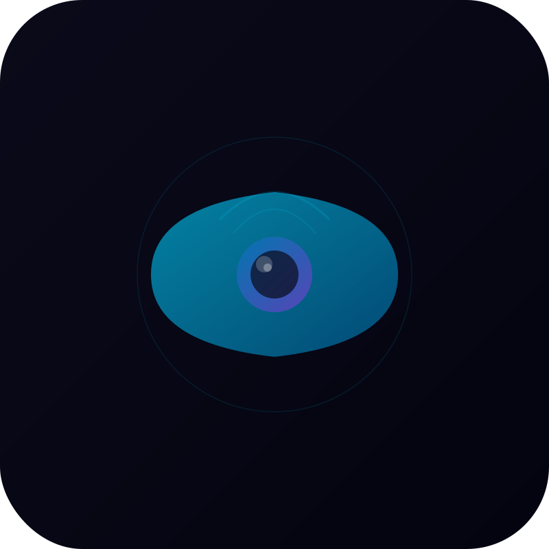
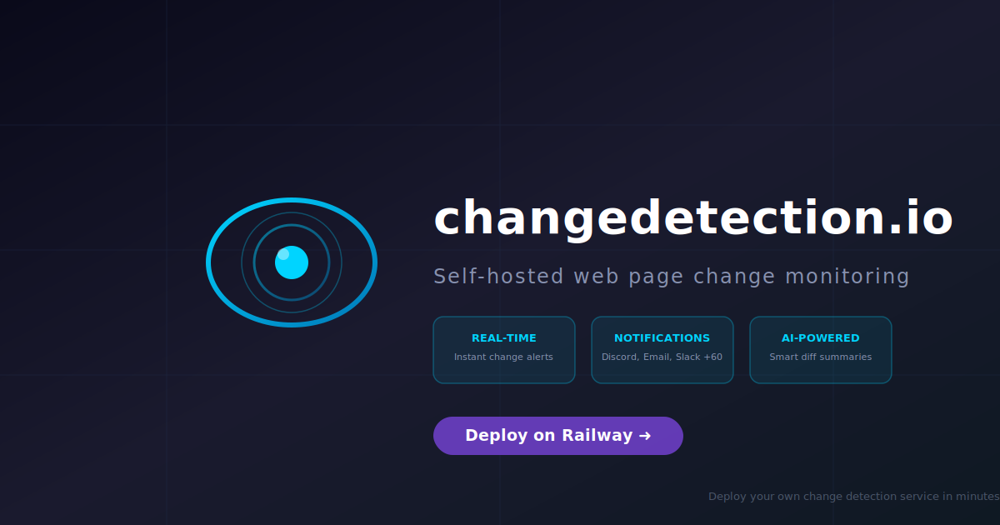

<div align="center">
  
  <h1 align="center">changedetection.io</h1>
  <p align="center">Self-hosted web page change monitoring — get instant alerts when any website changes.</p>
</div>

<p align="center">
  <a href="https://railway.com/template/changedetection-io"></a>
  <a href="https://github.com/dgtlmoon/changedetection.io"></a>
  <a href="https://github.com/dgtlmoon/changedetection.io/blob/master/LICENSE.md"></a>
  <a href="https://hub.docker.com/r/dgtlmoon/changedetection.io"></a>
</p>

<div align="center">
  
</div>

---

## ✨ Features

- **Real-time change detection** — Monitor any web page for content, price, or structural changes
- **60+ notification channels** — Discord, Email, Slack, Telegram, Webhook, Apprise, and more
- **AI-powered summaries** — LLM integration (OpenAI, Gemini, Ollama, Anthropic) for smart diff summaries
- **Visual Selector** — Point-and-click element targeting with browser fetcher
- **Browser Steps** — Log in, fill forms, click buttons before detecting changes
- **Filter engine** — XPath, CSS Selectors, JSONPath, jq, regex text filtering
- **Re-stock & Price detection** — Monitor product pages for stock and price changes
- **API & RSS** — Full REST API for watches and notifications
- **Screenshot diffs** — Visual change comparison with screenshots
- **Scheduling** — Timezone-aware recheck schedules with day-of-week and time limits

## 🚀 Deploy on Railway

### One-Click Deploy

[](https://railway.com/template/changedetection-io)

Click the button above to deploy changedetection.io instantly on Railway.

### Prerequisites

- A [Railway](https://railway.com) account
- No external database required — uses built-in SQLite storage

## ⚙️ Environment Variables

| Variable | Required | Default | Description |
|----------|----------|---------|-------------|
| `PORT` | No | `5000` | HTTP listen port (Railway sets this automatically) |
| `LOGGER_LEVEL` | No | `DEBUG` | Log level: `TRACE`, `DEBUG`, `INFO`, `SUCCESS`, `WARNING`, `ERROR`, `CRITICAL` |
| `BASE_URL` | No | — | Public URL of your instance (appears in notification alerts) |
| `USE_X_SETTINGS` | No | `1` | Set to `1` when behind Railway's reverse proxy |
| `HIDE_REFERER` | No | — | Hide Referer header from monitored websites |
| `FETCH_WORKERS` | No | `10` | Number of parallel fetch workers |
| `MINIMUM_SECONDS_RECHECK_TIME` | No | — | Minimum seconds between rechecks (`0` to disable) |
| `DISABLE_VERSION_CHECK` | No | — | Disable telemetry / version check |
| `LLM_FEATURES_DISABLED` | No | — | Disable all LLM / AI features |
| `ALLOW_FILE_URI` | No | — | Allow watching local `file:///` URIs (security!) |
| `TZ` | No | `UTC` | Timezone for scheduling (e.g., `America/New_York`) |
| `HTTP_PROXY` | No | — | HTTP proxy address for outgoing requests |
| `HTTPS_PROXY` | No | — | HTTPS proxy address for outgoing requests |
| `NO_PROXY` | No | — | Comma-separated proxy exclusion list |
| `SCREENSHOT_MAX_HEIGHT` | No | `16000` | Max screenshot height in pixels |
| `EXTRA_PACKAGES` | No | — | Space-separated extra Python packages to install (plugins) |
| `PLAYWRIGHT_DRIVER_URL` | No | — | WebSocket URL to a Playwright browser for JS-rendered pages |

## 📡 Service Architecture

```
┌──────────────────────────────────────────────────────────────────┐
│                     changedetection.io                            │
│                        Port 5000                                  │
│                                                                   │
│  ┌──────────────┐  ┌─────────────────┐  ┌──────────────────────┐ │
│  │  Web UI      │  │  Change Engine   │  │  Notification Engine │ │
│  │  (Flask)     │  │  (Scheduler)     │  │  (Apprise)           │ │
│  │  /           │  │  Per-watch       │  │  60+ channels        │ │
│  │  Watches     │  │  polling         │  │  Discord, Email,     │ │
│  │  Settings    │  │  Content diff    │  │  Slack, Telegram     │ │
│  └──────┬───────┘  └────────┬─────────┘  └──────────┬───────────┘ │
│         │                   │                        │            │
│         └───────────────────┼────────────────────────┘            │
│                             │                                     │
│                    ┌────────▼────────┐                            │
│                    │  SQLite (/datastore)  │                      │
│                    │  Watches, config,    │                      │
│                    │  notification history │                     │
│                    └─────────────────────┘                       │
└──────────────────────────────────────────────────────────────────┘
        │                        │
        │                   ┌────▼────┐
        │                   │  HTTP   │
        │                   │ Fetcher │
        │                   │ (fast)  │
   ┌────▼────┐              └─────────┘
   │ Playwright │
   │  Browser  │
   │ (JS support)│
   └───────────┘
```

## 💻 Local Development

### Prerequisites

- Docker installed on your machine

### Quick Start

```bash
# Clone the repository
git clone https://github.com/INAPP-Mobile/railway-changedetection.io.git
cd railway-changedetection.io

# Build and run with Docker
docker build -t changedetection .
docker run -d \
  --name changedetection \
  -p 5000:5000 \
  -v changedetection-data:/datastore \
  changedetection

# Open in browser
open http://localhost:5000
```

### Using Docker Compose

```yaml
services:
  changedetection:
    build: .
    ports:
      - "5000:5000"
    environment:
      - USE_X_SETTINGS=1
      - PORT=5000
    volumes:
      - changedetection-data:/datastore
    healthcheck:
      test: ["CMD", "python", "-c", "import urllib.request, os; urllib.request.urlopen(f'http://localhost:{os.getenv(\"PORT\", \"5000\")}/')", "||", "exit", "1"]
      interval: 30s
      timeout: 10s
      retries: 3
      start_period: 15s

volumes:
  changedetection-data:
```

### Adding a Browser Fetcher (Playwright)

For monitoring JavaScript-rendered websites, add a Playwright browser service:

```yaml
services:
  changedetection:
    # ... (same as above)
    depends_on:
      browser:
        condition: service_started
    environment:
      - PLAYWRIGHT_DRIVER_URL=ws://browser:3000

  browser:
    image: dgtlmoon/sockpuppetbrowser:latest
    cap_add:
      - SYS_ADMIN
    environment:
      - SCREEN_WIDTH=1920
      - SCREEN_HEIGHT=1024
      - SCREEN_DEPTH=16
      - MAX_CONCURRENT_CHROME_PROCESSES=10
```

## 🔧 Troubleshooting

| Issue | Solution |
|-------|----------|
| **Health check failing** | Ensure `PORT` env var matches the container's listen port (5000). Check Railway logs for startup errors. |
| **Data lost on restart** | Data is stored in `/datastore` (SQLite). Railway provides ephemeral storage that persists within service lifecycles. |
| **Slow first startup** | The image is ~400MB. First cold start may take 1–2 minutes for the health check to pass. |
| **Cannot access the UI** | Make sure `USE_X_SETTINGS=1` is set when behind Railway's proxy. Railway provides TLS at the edge. |
| **Monitored sites not checking** | Verify `FETCH_WORKERS` is set appropriately (default 10). Check if sites have IP-based blocks on Railway egress IPs. |
| **JS-rendered pages not detecting changes** | Set up a Playwright browser service and configure `PLAYWRIGHT_DRIVER_URL`. The default HTTP fetcher doesn't execute JavaScript. |
| **Notifications not sending** | Verify notification URLs are correctly formatted in the watch settings. Check Apprise documentation for your channel. |
| **Port conflict** | Railway assigns `PORT` automatically. If you override it, ensure it matches the `EXPOSE 5000` in the Dockerfile. |

## 📚 Resources

- **[changedetection.io Documentation](https://changedetection.io/tutorials)** — Official tutorials and guides
- **[GitHub Repository](https://github.com/dgtlmoon/changedetection.io)** — Source code & issues
- **[Installation Wiki](https://github.com/dgtlmoon/changedetection.io/wiki)** — Advanced configuration
- **[Notification Setup](https://github.com/caronc/apprise#popular-notification-services)** — Apprise notification channels
- **[Chrome Extension](https://chromewebstore.google.com/detail/changedetectionio-website/kefcfmgmlhmankjmnbijimhofdjekbop)** — Quickly add pages to watch
- **[Discord Community](https://discord.gg/k8R5P5w)** — Community discussions

## 📄 License

This template deploys [changedetection.io](https://github.com/dgtlmoon/changedetection.io), which is licensed under the **Apache License 2.0**. See the [LICENSE](https://github.com/dgtlmoon/changedetection.io/blob/master/LICENSE.md) file for details.

---

<p align="center">
  <sub>Built by <a href="https://github.com/INAPP-Mobile">INAPP-Mobile</a> — Deploy your own website change monitoring service in minutes.</sub>
</p>
